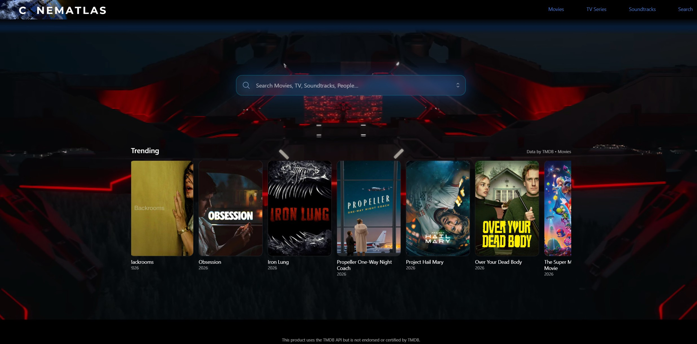
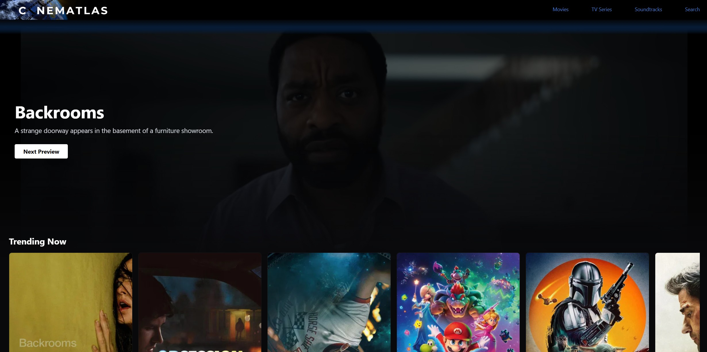

# Cinematlas

## Overview
Cinematlas is a movie discovery web application that enables users to explore trending movies, television series, and soundtracks through a modern, cinematic interface. The application integrates real-time data from The Movie Database (TMDB) API and presents it through a responsive, animation-driven user experience.
The project was developed to strengthen skills in frontend engineering, API integration, state management, performance optimization, and user interface design.

## Features

Browse trending movies and TV shows from TMDB
Dynamic video background across all pages
Responsive navigation and page routing
Smooth animations and transitions using Framer Motion
Horizontal trending carousel with hover-based scrolling
Client-side caching to reduce unnecessary API requests
Graceful handling of missing posters and API errors
Mobile-friendly responsive layout

## Technologies Used

Frontend
React
Vite
JavaScript (ES6+)
React Router
Styling & Animation
Tailwind CSS
Framer Motion
APIs
The Movie Database (TMDB) API
Development Tools
Git
GitHub
VS Code

## Architecture

The application follows a component-based architecture using React.
Key components include:
Navbar – Persistent navigation across all pages
Landing Page – Entry point featuring trending content
Movies Page – Displays trending movie data
TV Page – Displays trending television content
Soundtracks Page – Dedicated soundtrack section
Main Video Background – Shared cinematic background component
Trending Row – Reusable scrolling content carousel

## Installation
- Clone the repository
- git clone https://github.com/YOUR_GITHUB_USERNAME/cinematlas.git
- cd cinematlas
### Install dependencies
- npm install
### Create environment variables
#### Create a .env file:
- VITE_TMDB_KEY=your_tmdb_v3_key
- VITE_TMDB_V4_TOKEN=your_tmdb_v4_token
### Start development server
- npm run dev

## Performance Optimizations
Session storage caching for API responses
Lazy-loaded poster images
AbortController to prevent unnecessary fetch requests
Fallback poster generation for missing assets
Reduced API traffic through client-side caching

## Future Improvements
Movie and TV detail pages
Search functionality
User authentication
Personalized watchlists
AI-powered recommendation system
Streaming service availability integration
Advanced filtering and sorting options
Integration with a soundtrack database API to allow users to search for movie and television soundtracks
Direct links to soundtrack information and music streaming platforms
Composer and score discovery features
Soundtrack browsing by genre, composer, film, or television series

## Screenshots
### Landing Page

### Movies Page

## What I Learned
Through this project, I gained experience with:
REST API integration
React Hooks
Client-side routing
Component architecture
Frontend performance optimization
Responsive design principles
Managing asynchronous data flows

## License
This project is licensed under the MIT License.
